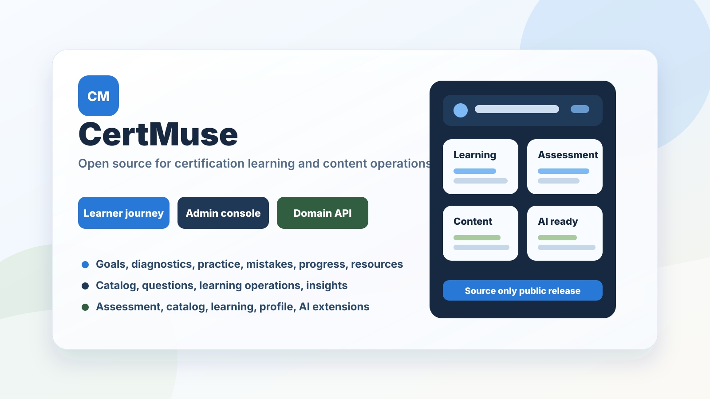
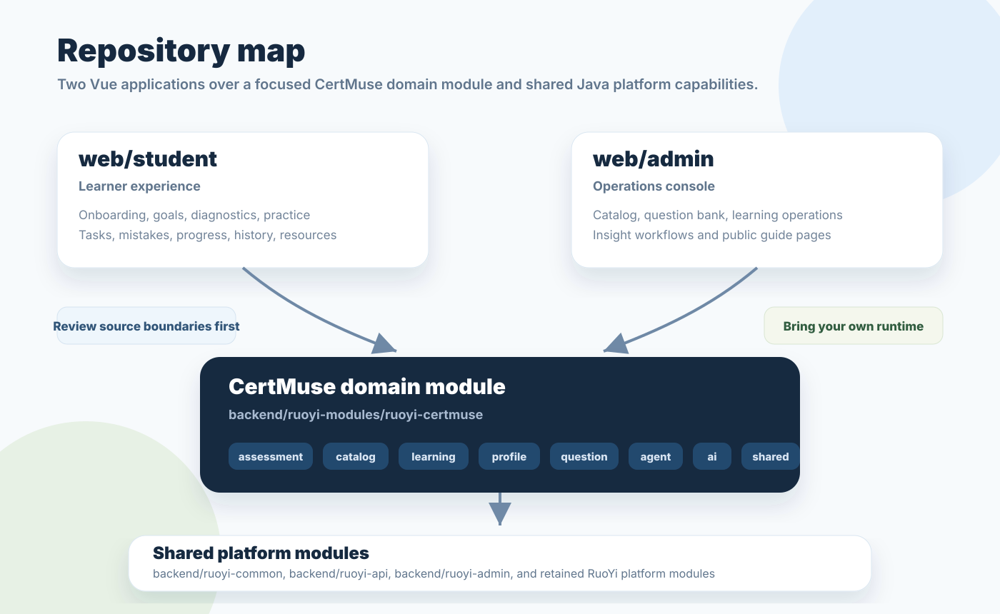

# CertMuse

> Certification learning, assessment workflows, and content operations in one source codebase.

**CertMuse** brings the learner journey and the operating workflow around certification preparation into one codebase: learner onboarding and goals, diagnostic assessment, question practice, learning records, content operations, and AI-oriented extensions.

It is useful to teams studying how a modern certification-learning product can separate learner experiences, administrator operations, domain services, and shared platform capabilities. It is published for source review, architecture study, and focused contributions; it is **not** a one-command deployable demo.

## Product loop

Most learning systems start as a question list. CertMuse treats certification preparation as a loop:

1. Set a learning goal.
2. Diagnose the learner's current level.
3. Practice with structured question workflows.
4. Review mistakes and progress.
5. Improve content and learning plans from operational feedback.

## Why CertMuse

- **Learning is a journey, not a list of questions.** The learner application covers onboarding, goals, diagnostics, practice, tasks, progress, history, mistakes, results, and resources.
- **Content operations are first-class.** The administrator application separates catalog, question, learning, and insight workflows instead of treating them as afterthoughts.
- **Domain boundaries are explicit.** The CertMuse backend groups assessment, catalog, learning, profile, question, agent, and AI concerns into focused areas.
- **Built for extension.** The repository keeps the learner and administrator applications separate while sharing a Java service foundation and common platform modules.

## Product surface

| Surface | Audience | What to explore |
| --- | --- | --- |
| Learner app | Students preparing for certification exams | Onboarding, learning goals, diagnostics, practice sessions, tasks, question bank, mistakes, progress, history, resources |
| Admin console | Content operators and administrators | Catalog operations, question-bank management, learning operations, insight workflows, public guide pages |
| Domain backend | Product and platform engineers | Assessment, catalog, learning, profile, question, agent, AI, and shared domain support |

## What is in this repository

| Area | What you can explore |
| --- | --- |
| `backend/` | Java and Spring Boot source, including the CertMuse domain module and shared platform modules |
| `web/admin/` | Vue administrator application for catalog, learning, insight, and question workflows |
| `web/student/` | Vue learner application for onboarding, goals, diagnostics, practice, progress, tasks, and resources |
| `docs/` | Public project overview and the exact scope of this release |

For a guided map of the code, see [Project overview](docs/PROJECT_OVERVIEW.md).

## Release scope: read this first

This is a **source release with a narrow local authentication demo**. It is not a production-ready one-command product.

`infra/docker/` provides an isolated PostgreSQL, Redis, backend and Nginx environment with one disposable `demo-admin` account. It verifies the API proxy, login, session identity and a minimal dashboard route without including real users, exam content or external service credentials. See [local demo instructions](infra/docker/README.md).

Complete database initialization and migrations, operational tooling, environment files, CI configuration, production secrets and business data remain outside this public release. Anyone deploying a real fork must provide their own complete PostgreSQL schema and migrations, Redis, secrets, administrator bootstrap and reverse-proxy configuration.

This boundary is intentional: it protects operational details and prevents a partial configuration from being mistaken for a secure production setup. Read [Release scope](docs/RELEASE_SCOPE.md) before attempting to run or redistribute the project.

## Architecture at a glance

The public code is organized around the product boundary rather than a single monolith of pages and endpoints. See [Project overview](docs/PROJECT_OVERVIEW.md) for the domain map and repository navigation.

## How to engage with the project

| You want to... | Start here |
| --- | --- |
| Understand the architecture | [Project overview](docs/PROJECT_OVERVIEW.md) |
| Report a defect or suggest an improvement | [Issue templates](.github/ISSUE_TEMPLATE) |
| Propose a change | [Contributing guide](CONTRIBUTING.md) |
| Report a vulnerability responsibly | [Security policy](SECURITY.md) |
| Understand licensing and upstream notices | [License](LICENSE) and [release scope](docs/RELEASE_SCOPE.md) |

## Contributing

Good first contributions improve documentation, clarify domain terminology, strengthen tests in a future runnable distribution, or make a focused change with a clear user outcome.

Please read [CONTRIBUTING.md](CONTRIBUTING.md) and [CODE_OF_CONDUCT.md](CODE_OF_CONDUCT.md) before opening an issue or pull request. Never include credentials, production data, private documents, or copied examination materials in an issue, pull request, or attachment.

## Security

Security reports must not be filed as public issues. See [SECURITY.md](SECURITY.md) for the responsible disclosure process and the maintainer setup required before public launch.

## License and attribution

CertMuse is released under the [MIT License](LICENSE). It contains code derived from RuoYi-Vue-Plus; the relevant upstream license notices remain in their component directories. Preserve all applicable notices when reusing or redistributing the code.

## Project status

CertMuse is published as a source-only, pre-release codebase. The public documentation deliberately distinguishes what is available today from what requires a separately provisioned environment. See [CHANGELOG.md](CHANGELOG.md) for release notes.

If the project is useful to you, a Star helps more people discover it. Thoughtful issues, documentation improvements, and focused pull requests help even more.
