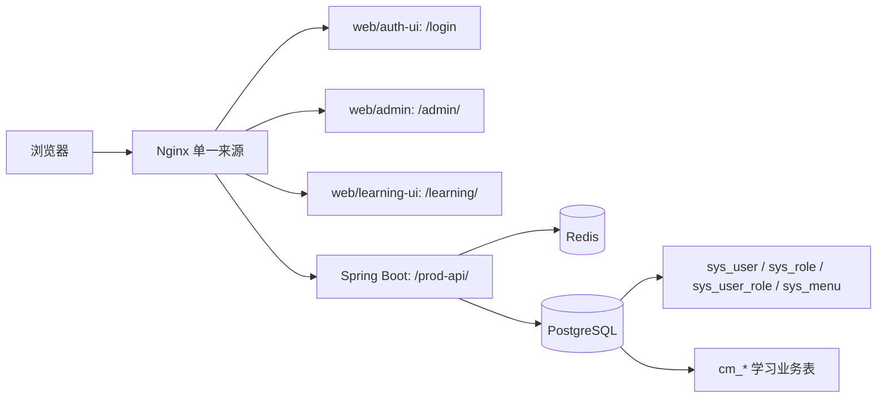

# CertMuse 统一登录与学员注册技术设计 V1.1

> 文档状态：实施基线
> 适用对象：后端、认证前端、管理端、学习端、数据库、测试与运维
> 依据：《学员注册与统一认证实施方案V1.md》、现有统一登录业务需求
> 本次范围：定义实现方式；不执行数据库迁移、配置启用或部署

## 1. 结论与边界

CertMuse 只有一张账号表`sys_user`，管理员、运营人员、内容编辑、审核人员和学员全部使用该表。系统不使用`sys_user.user_type`决定进入管理端还是学习端；入口由已启用角色的`entry_type`和入口权限共同计算。一个账号只能属于一种入口类型，不能同时是管理人员和学员。

固定术语如下：

| 名称 | 固定值 | 用途 |
| --- | --- | --- |
| 学员角色 | `student` | `sys_role.role_key`；表示学员身份 |
| 学员入口权限 | `certmuse:student` | `sys_menu.perms`；用于确认学习端入口资格 |
| 管理端入口权限 | `certmuse:entry:admin` | `sys_menu.perms`；用于确认管理端入口资格 |
| 入口类型 | `LEARNING`、`ADMIN` | 登录成功后的服务端计算结果，不由客户端提交 |

`sys_user.user_type`保留为RuoYi框架字段和既有数据兼容字段；本设计不再把它当作认证入口、接口权限或学习数据所有权依据。新注册学员不写入`app_user`，沿用框架默认`sys_user`。

### 1.1 四类信息的职责边界

下表是实现、联调和验收时唯一允许使用的判断依据。任何一列都不能替代另一列。

| 信息 | 存储位置 | 解决的问题 | 不负责什么 |
| --- | --- | --- | --- |
| 账号 | `sys_user` | 账号、密码散列、状态、最近登录和首次登录时间 | 不决定进入哪个前端，也不直接授予功能 |
| 角色 | `sys_role`、`sys_user_role` | 身份分组和入口归类。`student`表示学员角色 | 不作为接口权限码，不保存学习对象所有者 |
| 权限 | `sys_menu`、`sys_role_menu` | 是否具有入口资格以及能否访问具体菜单、按钮和接口 | 不表示账号类型，不替代数据所有权条件 |
| 学习数据所有权 | `cm_* .user_id` | 某条学习数据属于哪位学员 | 不授予管理数据范围或跨学员访问权 |

因此，注册时只写入`sys_user`和`sys_user_role`。`certmuse:student`已经预先由`student`角色经`sys_role_menu`关联到隐藏权限菜单，注册服务只校验该关联存在，不会创建“用户直接拥有某权限”的记录。

### 1.2 本版本对既有实施方案的取舍

《学员注册与统一认证实施方案V1.md》中以`user_type`和`userType`分流的内容，与本版本已经确认的“完全由角色和权限计算入口”决策不再同时生效。实施前必须把冻结接口契约、`LoginUser`、Sa-Token会话扩展字段和前端类型定义统一为`entryType`。在这些改造完成前，旧代码不得与新角色数据一起上线，否则会把学习账号按旧`user_type`逻辑错误分流。

本版本保留`user_type`仅为兼容现有框架表和历史数据，不允许新业务读取它作鉴权判断。若现有接口契约仍要求登录或`getInfo`返回`userType`，该契约必须先修订为`entryType`，并同步更新所有调用方；不能在新接口中同时返回两个字段让前端自行选择。

## 2. 总体架构



认证端只负责账号密码登录、受控注册、验证码、入口计算和安全跳转。管理端和学习端各自保留接口权限和数据权限校验；登录分流不构成授权。

技术基线：Java 21、Spring Boot 4.1、RuoYi-Vue-Plus 6.0.0-BETA、Sa-Token、MyBatis-Plus、PostgreSQL 16、Redis/Redisson、Vue 3、TypeScript、Vite、Element Plus、Vitest。

## 3. 角色、权限与入口计算

### 3.1 角色元数据

在`sys_role`增加`entry_type varchar(20) NOT NULL`，只允许`ADMIN`或`LEARNING`。所有可登录角色必须有入口类型；历史角色在迁移中明确归类，未归类角色不能作为可登录账号的有效角色。

| 角色示例 | `entry_type` | 必须拥有的入口权限 |
| --- | --- | --- |
| `student` | `LEARNING` | `certmuse:student` |
| `superadmin`、运营、编辑、审核等管理角色 | `ADMIN` | `certmuse:entry:admin` |

`certmuse:student`和`certmuse:entry:admin`使用隐藏权限菜单记录承载，不展示为后台可点击菜单。具体学习功能和管理功能仍分配各自的细粒度权限，例如`certmuse:learning:onboarding:query`、`system:user:add`。

### 3.2 单入口约束

用户分配、导入或修改角色时，系统读取所有启用角色的`entry_type`：

1. 没有启用角色或存在未归类角色：拒绝登录。
2. 只存在`LEARNING`：要求同时具备`student`和`certmuse:student`。
3. 只存在`ADMIN`：要求具备`certmuse:entry:admin`。
4. 同时存在`ADMIN`和`LEARNING`：拒绝角色保存；若历史数据已存在，拒绝登录并记录安全审计。

服务层在用户角色分配、批量导入、注册、角色状态变化和`entry_type`变更时执行校验。PostgreSQL增加可延迟约束触发器：`sys_user_role`变更时校验关联用户，`sys_role`的启用状态或`entry_type`变更时校验该角色的全部关联用户。两个触发器均在事务提交时再次检查每个用户的启用角色只能属于一种`entry_type`，防止直接写关联表或直接改角色元数据绕过服务层。

角色维护接口按下列规则执行，不能只检查本次提交的角色：

| 操作 | 必须校验的结果 |
| --- | --- |
| 给用户新增或替换角色 | 用户变更后的全部启用角色只能属于一个入口类型；已有另一入口类型时拒绝保存 |
| 批量导入角色 | 每一个目标用户独立校验；任一用户混合入口，整批按导入事务策略失败，不留下部分角色关系 |
| 启用角色 | 该角色关联的每个用户启用后仍只有一个入口类型；否则拒绝启用 |
| 修改`entry_type` | 修改后该角色关联的每个用户仍只有一个入口类型；否则拒绝修改 |
| 停用角色或解除角色 | 允许操作，但受影响账号后续必须仍有可解析的入口和入口权限，否则下一次登录拒绝 |

多个`ADMIN`角色可以共存，多个`LEARNING`角色也可以共存。禁止的是同一账号同时拥有两个入口类型，不是禁止同一入口内的多角色授权。

### 3.3 服务端入口解析

新增`AuthEntryResolver`，在密码、验证码、客户端和账号状态校验成功后加载当前用户角色及权限，返回：

```ts
type EntryType = 'ADMIN' | 'LEARNING';

type AuthRoutingInfo = {
  entryType: EntryType;
  firstLogin: boolean;
};
```

解析失败、角色混合、入口权限缺失或未知入口类型时，不创建可用会话。审计记录原因码，不返回角色配置细节。Sa-Token登录标识继续沿用框架`sys_user:userId`，不把`entryType`拼入登录标识。

## 4. 数据库与初始化设计

### 4.1 `sys_user`

| 字段或约束 | 设计 | 说明 |
| --- | --- | --- |
| `first_login_at` | `timestamptz NULL` | 首次成功登录时间；NULL表示从未成功登录 |
| `UNIQUE(user_name)` | 全局唯一 | 管理人员和学员不能使用相同账号；逻辑删除账号不复用用户名 |
| `user_type` | 保留原字段 | 不用于入口计算；不新增`app_user`取值要求 |
| `login_date`、`login_ip` | 保留 | 表示最近成功登录 |

迁移前先处理重复用户名。不得把历史`user_type`当作角色归类依据，也不得通过改写该字段把管理人员变为学员。

### 4.2 `sys_role`、`sys_menu`与关联

| 表 | 变更 | 说明 |
| --- | --- | --- |
| `sys_role` | 增加`entry_type` | `ADMIN/LEARNING`，角色入口元数据 |
| `sys_role` | 初始化`student` | 学员默认角色，`entry_type=LEARNING` |
| `sys_menu` | 初始化`certmuse:student` | 学员入口权限，隐藏权限菜单 |
| `sys_menu` | 初始化`certmuse:entry:admin` | 管理端入口权限，隐藏权限菜单 |
| `sys_role_menu` | 绑定入口权限 | 学员角色仅绑定学习入口及学习权限；管理角色绑定管理入口及对应管理权限 |

注册只按`role_key='student'`查询角色，不硬编码角色主键。学员角色不得绑定管理端菜单、按钮、`system:*`权限或管理数据范围。

迁移按固定顺序执行：先新增可回填的`entry_type`字段，再初始化两个入口权限和`student`角色，随后建立`sys_role_menu`关联；完成历史角色分类和混合入口审计后，才把`entry_type`收紧为非空检查并启用约束触发器。迁移脚本必须先报告重复用户名、未归类角色、混合入口账号和缺少入口权限的角色，存在任一项时停止收紧约束，不允许猜测分类或自动删除角色关系。

### 4.3 注册许可配置

注册同时满足以下条件：

```text
sys.account.registerUser = true
AND clientId 存在且状态正常
AND client.grantType 精确包含 password
AND clientId 属于 sys.account.registerClientIds
```

`sys.account.registerClientIds`使用逗号、分号或换行分隔，解析后去空格、去重并做精确相等匹配；空值表示没有客户端可注册。V1不修改`sys_client`结构，不新增`register_enabled`字段。生产默认关闭全局开关和白名单。

### 4.4 学习数据所有权

学习目标、会话、作答、报告、任务、错题、画像、证据和学习记录继续以各表`user_id`表示学员所有者。所有者必须是入口类型为`LEARNING`的账号；服务层从登录上下文取得`userId`，不接受客户端指定所有者。

`operator_id`、`create_by`、`reviewed_by`和`status_changed_by`是业务操作人，不得替代学员所有者。`cm_*`表继续不对框架`sys_user`建立物理外键；SQL、缓存键、异步任务和事件消费必须持续校验所有权。

所有者校验的最小实现如下。`id`和`user_id`缺一不可，`currentUserId`只能来自服务端登录上下文：

```sql
SELECT *
FROM cm_learning_session
WHERE session_id = #{sessionId}
  AND user_id = #{currentUserId};
```

## 5. 后端接口实施

### 5.1 登录

`POST /auth/login`继续使用`@ApiEncrypt`和统一`R<T>`响应。密码授权请求只允许：

```ts
interface LoginRequest {
  username: string;
  password: string;
  code?: string;
  uuid?: string;
  clientId: string;
  grantType: 'password';
}

interface LoginResult {
  access_token: string;
  expire_in: number;
  client_id: string;
  scope?: string;
  entryType: 'ADMIN' | 'LEARNING';
  firstLogin: boolean;
}
```

请求中出现`userType`、`entryType`、角色或权限字段一律拒绝。后端不返回`redirect`、目标URL或可执行路由。

登录流程：校验客户端及`grantType`、校验验证码并一次性消费、校验密码与账号状态、解析入口、建立Sa-Token会话、原子记录首次登录、返回结果。入口解析或首次登录记录失败时注销刚建立的会话。

首次登录使用条件更新：

```sql
UPDATE sys_user
SET first_login_at = CURRENT_TIMESTAMP
WHERE user_id = #{userId}
  AND first_login_at IS NULL;
```

影响一行返回`firstLogin=true`，影响零行返回`false`。该条件更新保证并发登录只有一个请求获得首次标记。

### 5.2 学员注册

`POST /auth/register`只创建学员，不向管理人员开放自助注册。

```ts
interface LearnerRegisterRequest {
  username: string;
  password: string;
  code?: string;
  uuid?: string;
  clientId: string;
  grantType: 'password';
}

interface LearnerRegisterResult {
  username: string;
  roleKey: 'student';
}
```

请求采用严格白名单。出现`userType`、`entryType`、`userId`、`roleId`、`roleIds`、角色编码、`deptId`、`postId`、`postIds`、菜单、按钮、权限、数据范围或所有者字段时，返回参数错误；`confirmPassword`只在前端校验。

注册事务顺序如下：校验四项注册许可、校验验证码、校验用户名2～30字符且全局唯一、BCrypt散列密码、查询启用的`student`角色，并校验该角色已通过`sys_role_menu`关联`certmuse:student`权限、插入`sys_user`、插入`sys_user_role`、提交事务。注册只建立用户与角色关联，不向`sys_user`直接写权限。角色、权限关联、用户写入或角色关联任一失败时整体回滚。成功响应不返回令牌、不建立会话；前端回到`/login`并预填账号。

| 注册步骤 | 读取或写入 | 失败处理 |
| --- | --- | --- |
| 注册许可 | 读取`sys_config`、`sys_client` | 返回注册未开放或客户端无权注册，不创建用户 |
| 默认角色校验 | 读取`sys_role`、`sys_role_menu`、`sys_menu` | `student`停用、缺少`LEARNING`或缺少`certmuse:student`时回滚 |
| 创建账号 | 写入`sys_user` | 用户名唯一约束冲突时回滚，返回统一账号已存在错误 |
| 分配身份 | 写入`sys_user_role` | 关联失败或触发器拒绝时回滚`sys_user` |

注册流程不会写入`sys_menu`、`sys_role_menu`、管理部门、岗位、数据范围或任何学习业务表。`student`角色及其权限关联只能由受控初始化或管理权限接口维护。

### 5.3 当前身份与入口信息

`GET /system/user/getInfo`只返回当前会话用户。为避免前端用角色文案猜测入口，响应增加服务端已计算的`entryType`：

```ts
interface CurrentUserInfo {
  user: {
    userId: string;
    userName: string;
    nickName: string;
  };
  entryType: 'ADMIN' | 'LEARNING';
  roles: string[];
  permissions: string[];
}
```

登录响应、当前身份响应和服务器会话中的`entryType`必须一致。入口重新计算失败或发现混合角色时，服务端清理会话并记录安全审计。接口不接受客户端`userId`，也不返回角色主键、密码散列和认证密钥。

### 5.4 Onboarding状态

`GET /api/learning/onboarding/status`要求：已登录、`entryType=LEARNING`、角色`student`、权限`certmuse:student`及对应学习接口权限。管理入口账号返回403，且不查询学习业务数据。

响应固定为：

```ts
interface OnboardingStatus {
  goalStatus: 'NONE' | 'ACTIVE' | 'PAUSED';
  diagnosticStatus: 'NOT_STARTED' | 'IN_PROGRESS' | 'PROCESSING' | 'COMPLETED' | 'FAILED';
  currentCertificationId?: string;
  activeSessionId?: string;
  nextAction:
    | 'SET_GOAL'
    | 'START_DIAGNOSTIC'
    | 'CONTINUE_DIAGNOSTIC'
    | 'WAIT_PROCESSING'
    | 'ENTER_HOME'
    | 'RETRY_DIAGNOSTIC'
    | 'CONTACT_SUPPORT';
}
```

服务端只返回枚举和业务标识，不返回URL。目标、首次诊断会话、报告和首批任务共同计算状态；`activeSessionId`仅在属于当前用户且有效时返回。状态不一致时返回带`traceId`的错误，不猜测下一页。

## 6. 前端、路由与会话

### 6.1 `web/auth-ui`

新建独立Vue应用`web/auth-ui`，负责唯一凭据入口`/login`和受控注册页。它使用Vue 3、TypeScript、Vite、Element Plus、Axios和Vue Router；只保存“记住账号”和经校验的非敏感`redirect`，不保存密码、验证码、入口类型或令牌。

登录成功后：

- `ADMIN`：跳转`/admin/`；管理端加载动态路由后再次确认权限并恢复合法后台深链。
- `LEARNING`：先请求onboarding状态；首次流程完成前忽略学习深链，完成后才恢复合法`/learning/**`地址。

管理端和学习端原登录路由使用`replace`跳转`/login`。学习端删除默认账号、任意密码、新老用户快捷分流和本地模拟登录状态。

### 6.2 `redirect`白名单

认证端只接受解码、规范化后仍属于`/admin/**`或`/learning/**`的站内路径。拒绝外部URL、协议相对地址、脚本协议、反斜杠绕过、双重编码、登录/注册/退出/错误循环地址和跨入口地址。目标业务端仍需再次校验权限及对象存在性。

### 6.3 同源会话

Nginx在同一来源提供`/login`、`/admin/`、`/learning/`和`/prod-api/`。浏览器会话通过`Secure`、`HttpOnly`、`Path=/`和适当`SameSite`的Cookie传递；前端不把令牌放入URL、Referer、浏览器历史、localStorage、sessionStorage或日志。

受Cookie保护的写接口校验同源`Origin/Referer`并使用项目统一CSRF令牌方案。退出登录时注销Sa-Token会话并清除Cookie。

### 6.4 Nginx与三端构建边界

| 路径 | 交付物 | 行为 |
| --- | --- | --- |
| `/login`及认证静态资源 | `web/auth-ui` | 唯一可提交账号密码和注册信息的页面 |
| `/admin/` | `web/admin` | 管理端SPA；旧登录路由只做`replace`跳转 |
| `/learning/` | `web/learning-ui` | 学习端SPA；旧登录路由只做`replace`跳转 |
| `/prod-api/` | Spring Boot | 统一认证和业务API，Cookie同源发送 |

三个前端分别设置与部署路径相同的Vite `base`和Vue Router history base。Nginx只负责按路径分发静态资源和代理API，不根据用户名、角色或Cookie选择前端。入口分流只能由`web/auth-ui`读取服务端返回的`entryType`后执行。

## 7. 数据权限、审计和错误处理

学员本人接口从`LoginHelper.getUserId()`取得所有者，在SQL层同时限定对象ID和`user_id`。访问他人资源与资源不存在返回相同的对外结果；批量操作逐项校验所有权；缓存键、后台任务和事件携带原始所有者。

管理接口要求`entryType=ADMIN`、管理端入口权限、具体功能权限和数据范围，不能复用学员“查看本人”接口。

登录、注册、入口解析、首次登录、onboarding恢复和越权访问记录`requestId/traceId`、结果和安全原因码。日志、埋点和错误响应不得记录密码、验证码、密码散列、令牌或Cookie正文。

## 8. 实施顺序与验收

1. 迁移`first_login_at`、用户名唯一约束、`sys_role.entry_type`、入口权限和`student`角色；导入前检查历史角色混合。
2. 完成角色分配校验，以及覆盖`sys_user_role`和`sys_role`状态/入口类型变更的PostgreSQL可延迟约束触发器，再实现`AuthEntryResolver`。
3. 改造登录、注册、`getInfo`和onboarding接口，并完成后端单元与集成测试。
4. 新建`web/auth-ui`，再调整管理端、学习端旧登录路由和路由守卫。
5. 配置Nginx同源路径和Cookie，完成端到端安全测试。

必须通过以下验收：

- 账户全部在`sys_user`，没有第二套账号或密码表。
- `student`是角色，`certmuse:student`是权限；两者缺一时不能进入学习端。
- 一个用户不能同时拥有`ADMIN`与`LEARNING`角色；历史混合账号不能登录。
- 注册只能创建学员角色，不能传入角色、部门、权限或所有者。
- 白名单外客户端、关闭的全局开关或无`password`授权的客户端不能注册。
- 并发首次登录只有一个请求返回`firstLogin=true`。
- 管理入口不能调用学习本人接口，学员入口不能访问管理接口或其他学员数据。
- 恶意`redirect`、未知入口、状态矛盾、会话过期和重复提交都有确定的安全结果。
- 三个前端分别通过typecheck、lint、Vitest和生产构建。

### 8.1 契约更新清单

本设计采用`entryType`，因此接口契约和前后端类型必须同时完成以下更新后才能开始联调：

| 接口或对象 | 删除或禁止 | 必须提供 |
| --- | --- | --- |
| `POST /auth/login`请求 | `userType`、`entryType`、角色和权限字段 | 用户名、密码、验证码、客户端和`password`授权方式 |
| `POST /auth/login`响应 | `userType` | `entryType`、`firstLogin`及现有令牌兼容字段 |
| `POST /auth/register` | `userType`、角色、部门、岗位、权限和所有者字段 | 用户名、密码、验证码、客户端和`password`授权方式；响应返回账号与`roleKey='student'` |
| `GET /system/user/getInfo` | `userType`作为入口判定字段 | 当前用户、角色集合、权限集合和服务端计算的`entryType` |
| 会话与后端上下文 | 按`user_type`判断跨端访问 | 已计算的`entryType`，并在每次身份查询时重新校验 |

任何一个调用方仍依赖`userType`时，不能声称已完成本设计的统一认证改造。
