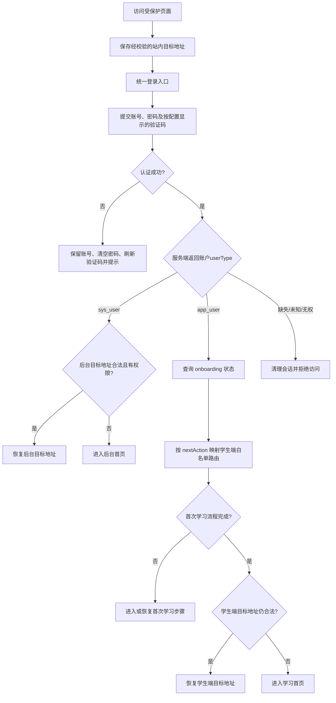

# CertMuse 统一登录界面业务与交互需求 V1.0

> 文档负责人：李亚鸿（产品顾问、内容域负责人）  
> 适用对象：产品、交互、前端、后端、测试与运维  
> 文档性质：产品需求基线，不代表接口或页面已经实现
> 评审状态：2026-08-11 产品基线已确认；后续开发按本文及第 8 节交接清单执行

## 1. 目标与边界

CertMuse 只向用户提供一个正式登录入口。管理员、后台用户和学员统一复用 RuoYi 的账号表与认证体系，通过 `sys_user.user_type` 区分 `sys_user` 管理账号和 `app_user` 学员账号，再通过 `sys_user_role`、`sys_role`、菜单权限及数据所有权决定可执行操作。登录成功后，系统依据服务端确认的 `userType` 和学习流程状态，将用户送入后台管理系统或学生端，不要求用户在登录前选择身份，也不允许前端根据账号名称、角色文案或本地缓存猜测身份。

本期包含统一账号密码登录、验证码、按用户类型与权限分流、学员自助注册、学生首次学习流程恢复、登录前目标地址恢复及相关异常反馈。不新增独立学员账户表；找回密码、第三方登录和身份切换能力不在本期范围。

产品术语与系统值统一如下：

| 产品称呼 | 账号与角色依据 | 登录后去向 |
|---|---|---|
| 管理员、后台用户 | `userType=sys_user` + 后台角色/菜单权限 | 后台管理系统首页 |
| 学员、普通用户 | `userType=app_user` + `certmuse:student` | 学生端首次流程或学习首页 |

## 2. 核心业务规则

### 2.1 统一认证与身份分流

1. 后台端和学生端不得各自保留可直接提交凭据的正式登录页；原登录路由统一跳转到独立认证入口，并携带经过校验的来源和目标地址。
2. 用户只输入账号、密码和按配置出现的验证码，不选择“管理员/学生”身份。
3. 端类型以认证成功账户的 `userType` 为唯一依据：`sys_user` 只能进入管理端，`app_user` 只能进入学生端；角色、菜单、按钮权限和数据范围在所属端内继续限制具体操作。类型缺失、未知、与当前会话不一致或账户在所属端无有效权限时，终止分流、清理本次会话并提示“当前账号无可用访问权限，请联系管理员”。
4. 仅有后台入口权限的账号不查询学习目标和首次诊断状态；无论是否第一次登录，均进入后台管理系统首页。访问合法后台深链时，可在权限校验通过后恢复该地址。
5. 进入学生端的账号必须查询服务端 onboarding 状态，再决定学生端落点。前端不得使用 localStorage、登录次数、角色名称文案或是否存在前端页面缓存替代该查询。

### 2.2 “首次登录”与“首次流程”定义

- **首次登录**：账号生命周期内第一次成功完成认证。服务端必须在同一原子操作中判定并记录，响应中的 `firstLogin` 只表达本次认证前是否从未成功登录。
- **首次学习流程**：设置有效学习目标、阅读诊断说明、完成 50 题首次诊断、生成诊断报告并进入学生首页的连续业务流程。
- 首次登录会触发首次学习流程，但 `firstLogin=false` 不代表首次学习流程已经完成。用户中途退出、会话过期、换设备或重新登录后，仍按服务端目标和诊断状态恢复未完成步骤，不得绕过诊断直接进入首页。
- `firstLogin` 仅用于欢迎语、埋点和审计，不单独决定路由；实际路由由 `nextAction` 和业务状态共同决定。
- 用户切换考试资格后需要重新诊断时，同样按未完成诊断状态处理，但不把该用户重新标记为首次登录。

### 2.3 学生端跳转优先级

登录成功后按下表自上而下匹配，首次流程优先于登录前的 `redirect`：

| 优先级 | 服务端状态 | `nextAction` | 目标页面与行为 |
|---:|---|---|---|
| 1 | 无有效学习目标 | `SET_GOAL` | `/learning/onboarding`，进入精简目标创建态 |
| 2 | 有目标、诊断未开始 | `START_DIAGNOSTIC` | `/learning/diagnostic/intro`，展示规则后由用户开始 |
| 3 | 诊断进行中且会话有效 | `CONTINUE_DIAGNOSTIC` | 恢复 `activeSessionId` 对应题目和已保存进度 |
| 4 | 已提交、报告或任务生成中 | `WAIT_PROCESSING` | 进入诊断处理状态页；允许刷新，禁止重复提交 |
| 5 | 诊断完成 | `ENTER_HOME` | `/learning/home`；符合条件时再恢复合法学生端 `redirect` |
| 6 | 诊断失败 | `RETRY_DIAGNOSTIC` 或 `CONTACT_SUPPORT` | 展示失败原因、可重试操作或技术支持入口 |

补充规则：

- `goalStatus=PAUSED` 时不自动创建新任务。若诊断已完成，进入首页并显示目标暂停状态；若首次诊断尚未完成，保留进度并提供“恢复目标后继续”的明确操作。
- `activeSessionId` 缺失、会话已失效或不属于当前用户时，不拼接猜测地址；重新查询状态。仍不一致时显示可重试错误并记录追踪标识。
- 诊断完成但报告尚不可读时仍属于处理状态，不能提前展示模拟报告或默认画像。

### 2.4 登录前目标地址

1. 只有站内、白名单路由才能保存为 `redirect`；拒绝外部 URL、协议相对地址、脚本协议、编码绕过和越权地址。
2. 服务端按当前账号角色与菜单权限校验目标端；后台地址和学生端地址均只能在账号具备对应入口权限时恢复。
3. 学生首次流程未完成时忽略本次跳转并优先完成流程。完成后可恢复仍然有效的学生端目标；目标失效、无权限或业务对象不存在时进入学生首页。
4. 登录页、错误页和退出页不能作为登录后的循环跳转目标。浏览器返回不得重新提交登录表单或回到含一次性交换凭证的地址。

## 3. 页面与交互规格

### 3.1 页面结构

桌面端采用品牌说明区和登录卡片双栏布局；移动端隐藏非必要插画，保留产品名、简短说明和单列登录表单。页面至少包含账号、密码、按配置显示的验证码、记住账号、登录按钮、隐私提示和技术支持入口。

正式页面不得包含默认明文账号密码、演示账号提示、“新用户/老用户”快速登录、身份切换按钮或“任意密码”说明。密码默认掩码，可提供按住或点击查看；验证码图片必须有刷新操作和可访问文本。

### 3.2 初始化与提交

| 场景 | 交互规则 |
|---|---|
| 页面初始化 | 读取验证码开关和经过校验的 `redirect`；加载失败时保留可用的基础登录能力，必须依赖验证码而验证码不可用时显示重试 |
| 表单校验 | 账号、密码和启用时的验证码必填；错误就近显示，输入修正后清除对应错误 |
| 提交中 | 锁定登录按钮和重复回车提交，按钮显示“登录中”；账号和密码不得写入 URL 或日志 |
| 登录成功 | 建立安全会话，取得权威身份与分流状态；状态查询期间显示“正在进入系统”，不闪现任一业务首页 |
| 记住账号 | 只保存账号和用户明确选择的记住状态；不得保存密码、验证码、访问令牌或一次性交换凭证 |
| 登录失败 | 保留账号和记住选项，清空密码；验证码启用时刷新验证码；焦点回到需要修正的首个字段 |

### 3.3 异常、会话与重复登录

| 状态 | 用户反馈与处理 |
|---|---|
| 账号或密码错误 | 统一提示“账号、密码或验证码错误”，避免泄露账号是否存在；连续失败限制沿用安全策略 |
| 账号禁用、锁定或过期 | 显示服务端允许公开的账户状态和联系管理员入口，不建立业务端会话 |
| 网络异常或超时 | 停留在登录页，恢复按钮可操作状态，提示检查网络并支持重试；不得把未知结果当作成功 |
| 状态查询失败 | 保留已建立会话并提供重试；连续 401/无效会话则清理会话返回登录页 |
| 会话过期 | 受保护页面保存合法原地址后进入统一登录页；重新登录仍先执行身份和首次流程判断 |
| 重复登录 | 按平台会话策略处理；若旧会话被替换，旧端明确提示已在其他位置登录，不静默丢失未保存输入 |
| 无可用角色或入口权限 | 清理会话、停止跳转、显示联系管理员提示并记录可追踪错误码 |
| 浏览器返回/刷新 | 不重复提交凭据；一次性交换凭证消费后立即 `replace` 清理地址，刷新后从当前会话恢复 |

### 3.4 可访问性与移动端

- 所有输入具备可见标签或等价无障碍名称，错误信息与字段关联；键盘可完成输入、刷新验证码、提交和访问支持入口。
- 聚焦状态、错误状态和禁用状态不能只依靠颜色表达；加载提示应被辅助技术感知。
- 移动端按钮保持易点击尺寸，软键盘弹出时当前字段和错误仍可见；横竖屏切换不得清空已输入账号。
- 不在移动端展示影响登录完成的全屏营销弹层。

## 4. 接口与安全契约

### 4.1 认证结果

登录或登录后的安全身份查询必须提供以下权威信息：

```ts
type AuthRoutingInfo = {
  userType: 'sys_user' | 'app_user';
  firstLogin: boolean;
};
```

`userType` 取自认证成功的账户记录，不由客户端请求传入或覆盖，也不能由角色名称推断。`sys_user` 与 `app_user` 不能跨端访问；只有目标地址属于当前端且通过权限校验时才能恢复。第一次成功登录标记需由服务端原子更新，避免并发请求同时返回 `firstLogin=true`。认证响应不得返回任意跳转 URL；访问令牌、刷新令牌或密码不得进入 URL、Referer、页面源码、浏览器历史或应用日志。

### 4.2 学生 onboarding 状态

```ts
type OnboardingStatus = {
  goalStatus: 'NONE' | 'ACTIVE' | 'PAUSED';
  diagnosticStatus: 'NOT_STARTED' | 'IN_PROGRESS' | 'PROCESSING' | 'COMPLETED' | 'FAILED';
  currentCertificationId?: string;
  activeSessionId?: string;
  nextAction:
    | 'SET_GOAL'
    | 'START_DIAGNOSTIC'
    | 'CONTINUE_DIAGNOSTIC'
    | 'WAIT_PROCESSING'
    | 'ENTER_HOME'
    | 'RETRY_DIAGNOSTIC'
    | 'CONTACT_SUPPORT';
};
```

`GET /api/learning/onboarding/status` 仅允许具有 `certmuse:student` 角色及对应权限的 `app_user` 调用，并从当前登录上下文确定用户。服务端保证状态与 `nextAction` 一致；前端仅将枚举映射到本地白名单路由，绝不执行服务端返回的任意 URL。未知枚举进入安全错误态并要求刷新，不默认进入首页。

### 4.3 独立入口与两端会话

- 服务器只对外提供一个端口，统一登录、后台端、学生端和后端 API 必须部署在同一来源下，由反向代理按路径分发。
- 对外路径固定为：`/login` 是唯一登录入口，`/admin/` 承载后台端，`/learning/` 承载学生端，`/prod-api/` 代理后端 API。前端构建基路径、路由 base 和静态资源路径必须与此保持一致。
- 同源会话使用 `Secure`、`HttpOnly`、`Path=/` 和合适 `SameSite` 属性的安全 Cookie；不设计跨域登录，也不通过 URL 在两个前端之间传递访问令牌、刷新令牌或一次性交换凭证。
- `/admin/login`、学生端原登录路由及未登录的受保护页面统一使用 `replace` 跳转 `/login`，仅携带经过校验的站内 `redirect`；不得形成登录循环。
- 后台和学生端仍需各自执行权限校验，登录分流不替代接口授权和数据范围控制。

## 5. 埋点、审计与隐私

- 记录登录提交、成功、失败类别、分流结果、状态恢复结果和异常错误码；关联 requestId/traceId，但不记录密码、验证码、令牌或完整敏感身份信息。
- 分流埋点至少区分 `sys_user`、`app_user` 和拒绝访问，不把 `firstLogin` 当作诊断完成状态。
- 首次流程恢复需记录来源状态与目标步骤，用于识别用户卡点；业务分析数据使用内部用户标识。
- 页面隐私提示说明账号信息仅用于身份认证，诊断结果用于个性化学习且不对外公开。

## 6. 验收标准

1. 仅有后台入口权限的账号第一次及后续登录都进入后台；合法后台深链在权限通过后可恢复。
2. `app_user` 学员账号首次登录且无目标时进入 `/learning/onboarding`，保存目标后进入诊断说明。
3. `app_user` 学员账号在目标设置、诊断答题或结果生成阶段退出后，再次登录恢复正确步骤，不能绕过进入首页。
4. 诊断进行中恢复原会话和已保存进度；会话无效时不访问其他用户会话，并给出可恢复反馈。
5. 诊断完成后进入学生首页；处理状态禁止重复提交；失败状态提供重试或支持入口。
6. 目标暂停时不生成新任务，页面明确说明恢复目标后的下一步。
7. 登录前地址只有在角色、首次流程和权限均允许时恢复；外部或恶意 `redirect` 被拒绝。
8. 伪造入口、无有效角色、禁用或无权账户，均不能进入任一业务端。
9. 连续点击或回车只产生一次有效登录提交；失败后保留账号、清空密码并按配置刷新验证码。
10. 本地存储、URL、Referer、浏览器历史、前端日志和服务端应用日志中不存在密码、验证码或访问令牌。
11. 原后台端和学生端登录路由均跳转统一入口，正式构建中不存在模拟账号、默认密码和新老用户快捷入口。
12. 桌面端、移动端和纯键盘操作均可完成登录，错误、加载和禁用状态表达清晰。

## 7. 与现有需求的关系

本文件是统一登录与登录后分流的产品基线。`12-一期界面级功能需求分析.md` 与 `13-一期界面功能详细设计.md` 中 U01 继续描述其所属页面体系，但账号角色、首次登录、首次流程恢复、跳转优先级和安全规则以本文件为准。学习目标、50 题诊断、报告和首页的具体业务规则仍由对应 U03～U06 及用户端核心闭环规格定义。

## 8. 已确认流程与开发交接

### 8.1 统一登录流程



### 8.2 功能清单

| 领域 | 必须实现 | 明确不在本期 |
|---|---|---|
| 登录入口 | 账号、密码、配置化验证码、记住账号、学员注册、隐私提示、技术支持 | 找回密码、第三方登录、身份选择、快捷演示账号 |
| 身份分流 | 服务端从账户记录返回 `userType`，所属端内继续校验角色、菜单和数据权限 | 前端根据账号、角色文案或缓存猜测身份 |
| 流程恢复 | 学员查询 onboarding；后台恢复有权限深链 | 用 `firstLogin` 或登录次数直接决定学员落点 |
| 地址恢复 | 站内白名单、端类型匹配、权限与业务对象校验 | 外部 URL、协议相对地址、脚本协议及循环地址 |
| 异常处理 | 认证失败、账户异常、网络超时、状态查询失败、会话过期、重复登录、未知类型 | 未知状态默认进入首页或静默失败 |
| 安全与审计 | 防重复提交、敏感信息不落 URL/日志/本地存储、分流结果可追踪 | 在地址栏传递访问令牌、刷新令牌或密码 |
| 可访问性 | 可见标签、字段关联错误、键盘操作、移动端输入可见 | 仅依靠颜色表达错误、加载或禁用状态 |

### 8.3 状态跳转表

| 账户/状态 | 前端动作 | 目标或结果 | `redirect` 处理 |
|---|---|---|---|
| `sys_user` | 不查询 onboarding，执行后台权限校验 | 后台首页或合法后台深链 | 仅恢复有权限后台地址 |
| `app_user` + `SET_GOAL` | 进入目标创建态 | `/learning/onboarding` | 暂不恢复 |
| `app_user` + `START_DIAGNOSTIC` | 展示诊断规则 | `/learning/diagnostic/intro` | 暂不恢复 |
| `app_user` + `CONTINUE_DIAGNOSTIC` | 校验并恢复 `activeSessionId` | `/learning/diagnostic/session` | 暂不恢复 |
| `app_user` + `WAIT_PROCESSING` | 展示处理状态并允许刷新 | `/learning/home?state=processing` | 暂不恢复 |
| `app_user` + `ENTER_HOME` | 进入已完成流程 | 合法学生深链或 `/learning/home` | 合法时恢复 |
| `app_user` + `RETRY_DIAGNOSTIC` | 展示失败原因和重试操作 | `/learning/diagnostic/intro?mode=retry` | 不恢复 |
| `app_user` + `CONTACT_SUPPORT` | 展示追踪标识和支持入口 | `/learning/home?state=support` | 不恢复 |
| 类型缺失、未知或无权 | 清理本次会话并记录错误码 | 拒绝访问提示 | 丢弃 |

### 8.4 当前实现差距与开发边界

截至 2026-08-11，管理端已有真实账号密码登录、验证码、令牌与权限路由；学生端 `/login` 仍为带默认账号、任意密码和新老用户快捷分流的纯 UI 原型。仓库中尚未发现学习目标、诊断会话及 onboarding 状态的后端实现，因此不得宣称统一分流已经联调完成。

开发实施必须遵守以下边界：

1. 后端补齐基于 RuoYi 角色权限计算的 `AuthRoutingInfo`、首次登录原子标记和仅限学员角色的 onboarding 状态接口，并完成无权限拒绝策略。
2. 单端口反向代理按 `/login`、`/admin/`、`/learning/`、`/prod-api/` 分发；两个前端使用同源安全 Cookie，共享身份源但分别执行权限校验。
3. 移除两端重复凭据入口和学生端演示分流，实现统一的安全 `redirect` 校验、固定枚举路由映射、状态查询重试、会话清理和防重复提交。
4. 测试按第 6 节 12 条标准覆盖桌面端、移动端、键盘操作、恶意地址、未知类型和流程恢复；未有真实接口证据前，不以 Mock 或本地缓存作为联调通过依据。

### 8.5 角色与验收责任

- 李亚鸿负责本文业务规则、交互说明和产品验收口径的解释与变更确认，并参与产品验收。
- 任务拆分、排期、日常追踪、跨端依赖、合并协调和部署安排不属于李亚鸿职责。
- 开发责任人负责实现、代码评审和自动化测试；测试及项目责任人负责记录通过项、缺陷、阻塞项和最终验收。
- 李亚鸿原则上不同时承担项目管理、功能开发、部署和最终验收。
